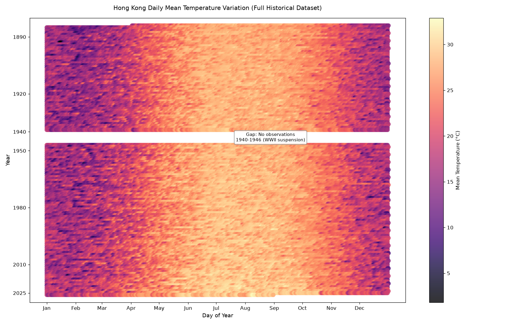

## The phenomenon
Surface air temperature shows strong seasonal cycles every year, while long‑term records also reveal multi‑decadal climate variation in Hong Kong. This visualisation explores how daily mean temperature changes across seasons and over more than one century. We examine both repeating annual summer‑winter temperature cycles and historical gaps in meteorological observations caused by World War II.

## The source
Data is retrieved from the Hong Kong Observatory CLMTEMP historical daily mean temperature open dataset.
This dataset contains daily observations from 1890‑2025, approximately 49 000 records, including year, month, day and daily‑mean air temperature in degrees Celsius.
The dedicated old documentation webpage for this dataset has been retired. The program fetches raw JSON data from the Observatory open‑data service, then converts it into a local CSV file for subsequent visualisation.

## What the picture shows
The horizontal axis represents day‑of‑year to show seasonal change, and vertical axis plots years, with older years placed at top and newer years at bottom. Colour encodes daily mean temperature, with warmer tones representing higher values. A text annotation highlights the 1940‑1946 observation gap during WWII. This visualisation discards precise calendar timestamps and short‑term weather events, focusing only on aggregated daily temperature patterns.

## Run it
This project uses uv for dependency management.

Install dependencies:
```bash
uv sync